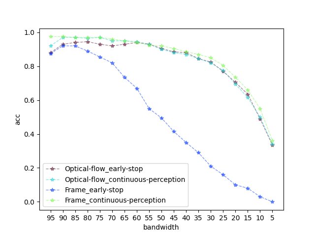

# GarOFV

# This code is for our paper "Continuous Perception Garment ClassificationBased on Optical Flow Variation".

# install
```bash
git clone https://github.com/hhhhhli/GarOFV.git
cd GarOFV
pip install -r requirements.txt  # install
```

# preparation
The dataset can be downloaded from the link below:

[https://github.com/LiDuanAtGlasgow/GarNet](https://github.com/LiDuanAtGlasgow/GarNet)

The image-based classification model can be acquired according to [GarNet](https://github.com/LiDuanAtGlasgow/GarNet).Which can be replaced by other image_based classification methods.

If you need to change the dataset and classification model paths, Modify the video_classify_module.py file.
```python
354    file_path='./Database/'
355    model_path='./Models/'
```

## Run the code
You can use command line arguments
```bash
    --bandwidth     
    --use_flow
    --use_early_stop
```
to modify bandwidth, whether to use our optical-flow based method and whether to use early-stop model.

For example, to run in continuous perception model with our method, and set the bandwidth is 95, can use the following bash command:
```bash
python -B video_classify_module.py --bandwidth 95 --use_flow True --use_early_stop False
```
To run in early-stop model with our method, and set the bandwidth is 55, can use the following bash command:
```bash
python -B video_classify_module.py --bandwidth 55 --use_flow True --use_early_stop True
```
Can run the run.sh file to obtain the run result in different modes and bandwidth
```bash
bash run.sh
```
The results are saved in the Results directory, and run the line_chart.py file can get the visualization results.
```bash
python line_chart.py
```


## References and acknowledgement
Our code refers to Li Duan's GarNet algorithm.


[https://github.com/LiDuanAtGlasgow/GarNet](https://github.com/LiDuanAtGlasgow/GarNet)